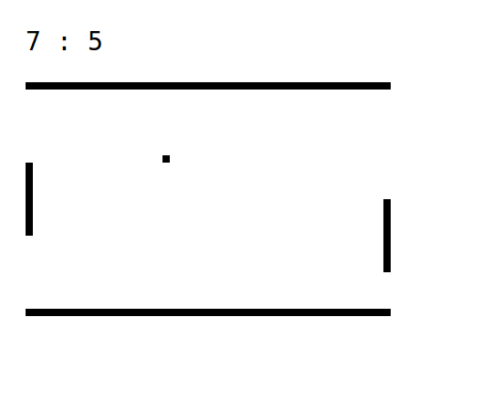

# poeng
## what is this
a simple multiplayer pong game server, written by a rust beginner who is looking for feedback on his (probably very ugly) code



## setup
obviously, you need rust installed (visit http://rustup.rs if you don't have it installed yet)

server setup is as simple as ```cargo run 0.0.0.0:4321``` and entering the ip of the server into the client's script.js file

the client can then be served from a simple http server (e.g. ```sudo python3 -m http.server 80```) or copied to another pc

## protocol
communication happens over websockets

all messages (except register) have to be prefixed with the player id

the response begins with the message type

### before a game
- register
	returns a new player id
- [id] play
	returns "ok" if an opponent has been found or "wait" if noone else wants to play yet

### during a game
- [id] config  
	returns width, height of the play area and the pad height
- [id] side  
	returns the side of the player ("left" or "right")
- [id] opponent  
	returns the y-position of the opponent
- [id] points
	returns the points of both players
- [id] ball  
	returns the position and velocity of the ball
- [id] move [y]  
	sets the y-position of the player

### to exit a game
- [id] exit  
	returns "ok" if the player has left the game or "err" if the game was already closed

games also close when there is no activity for a longer period of time
